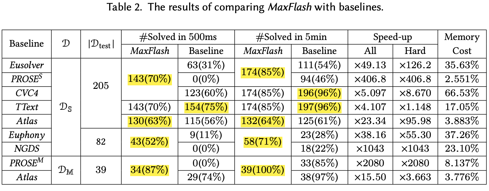
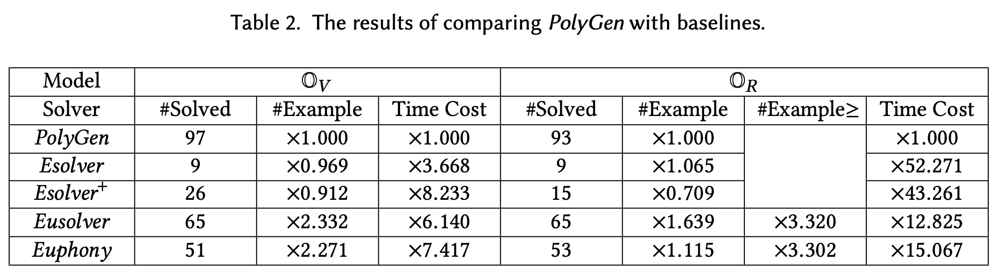
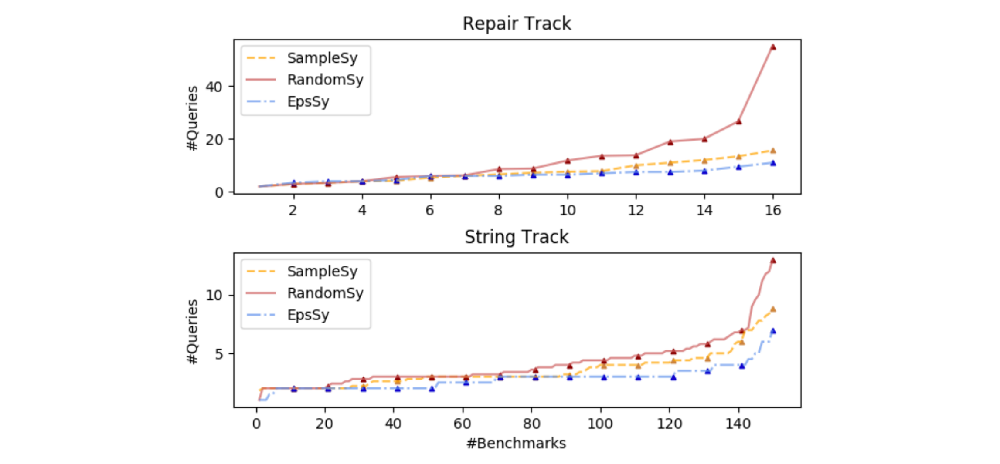
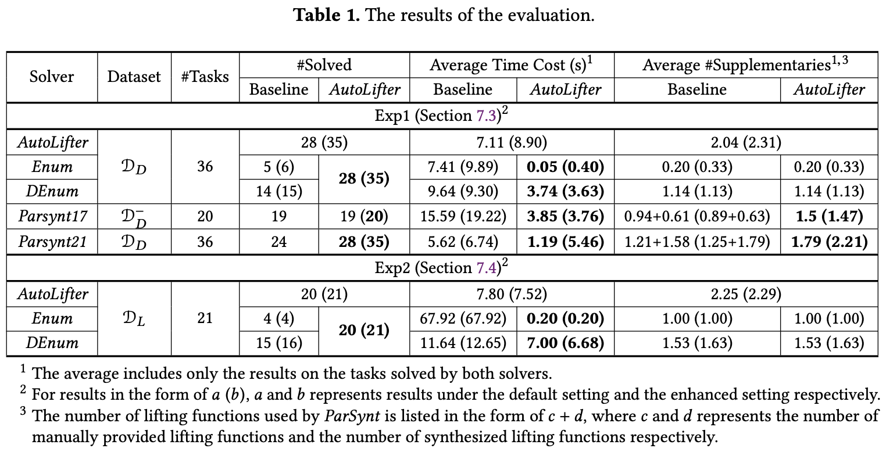
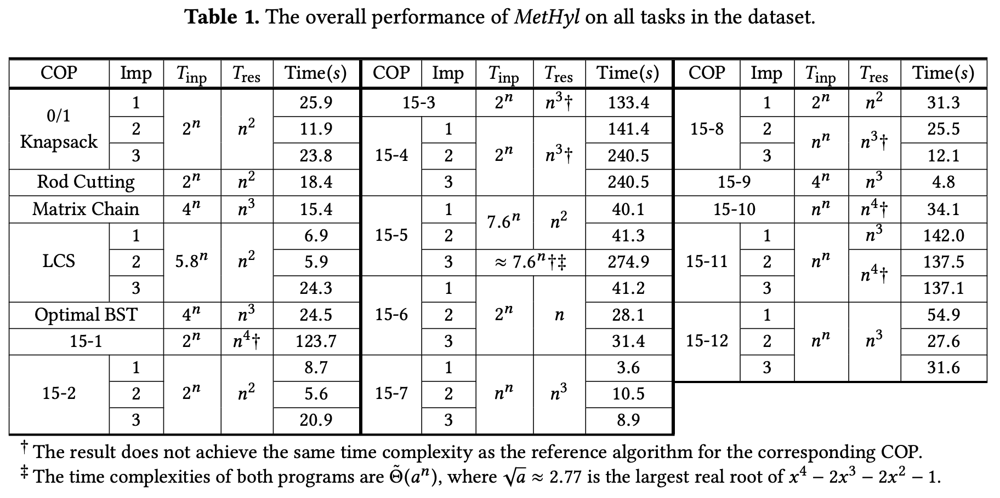

## Introduction

Inductive program synthesis is an important branch of program synthesis, where the program is synthesized from a set of examples. In the past decade, inductive synthesis techniques have been applied to various application domains, such as string manipulation, data wrangling, program repair, deobfuscation, and SQL queries. Moreover, recent studies show that inductive synthesis techniques can also be applied to synthesize efficient algorithms with the help of algorithmic tactics.

In this project, we provide a library for inductive synthesis in C++. On the one hand, the library provides infrastructures such as a basic language model, interfaces for SyGuS tasks, and a builder for the version space algebra. On the other hand, the library includes the reference implementations of several classical techniques for inductive synthesis and related approaches proposed by the <a href="https://pl.cs.pku.edu.cn/">PL Lab</a> at Peking University.
We hope this project could facilitate the further development and education of inductive program synthesis.

## Contents 

### Inductive Synthesizers 

An inductive synthesizer synthesizes a program from a set of examples from a given program space, which is usually specified by a context-free grammar.

<strong>MaxFlash</strong> <a href="https://jiry17.github.io/paper/OOPSLA20.pdf">[OOPSLA20]</a>

<em>MaxFlash</em> uses a model based on structural probability, namely topdown prediction models, to guide a search based on dynamic programming, such that the search will focus on subproblems that form probable programs, and avoid improbable programs.

Our evaluation shows that <em>MaxFlash</em> achieves ×4.107-×2080 speed-ups against state-of-the-art solvers on 244 real-world tasks.

  

  

<strong>PolyGen</strong> <a href="https://jiry17.github.io/paper/OOPSLA21.pdf">[OOPSLA21]</a>

<em>PolyGen</em> follows the STUN framework, a state-of-the-art framework for synthesizing programs with nested if-then-else operators, and its generalizability is theoretically guaranteed via the theory of Occam learning.

Our evaluation shows that <em>PolyGen</em> significantly outperforms two state-of-the-art solvers on CLIA, <em>Eusolver</em> and <em>Euphony</em>, on both generalizability and efficiency.

  

  

### Question Selectors

A question selector selects examples for an inductive synthesizer, and thus improve the performance of the synthesizer, such as the efficiency and the generalizability.

<strong>SampleSy</strong> and <strong> EpsSy </strong> <a href="https://jiry17.github.io/paper/PLDI20.pdf">[PLDI20]</a>

In terms of optimizing the generalizability, the problem of selecting questions can be reduced to the problem of constructing the optimal decision tree. <em>Minimax branch</em> is a state-of-the-art strategy for the latter, which selects the question where the worst answer gives the best reduction of the program domain.

<em>SampleSy</em> uses sampling to approximate this strategy and achieves a short response time. <em>EpsSy</em> further reduces the number of questions by allowing a bounded error rate. 

Our evaluation on the domains of program repair and string manipulation shows that a commonly used random strategy uses 13.9%-38.5% more questions than <em>SampleSy</em>, while <em>SampleSy</em> uses 35.0%-54.4% more questions than <em>EpsSy</em>.

  

  

### Algorithm Synthesizers

An algorithm synthesizer targets a predefined class of algorithms, and its task is to automatically apply these algorithms to a user-provided program.

<strong>AutoLifter</strong> <a href="./papers/AutoLifter.pdf">[Manuscript]</a>

<em>AutoLifter</em> applies divide-and-conquer to a user-provided program $p$ by synthesizing a lifting scheme $f$ and a combinator $c$ from the following formula.  

$$\forall l_1, l_2 \in \texttt{List}, (p\ (l_1 \!+\!\!\!+\ l_2), f\ (l_1 \!+\!\!\!+\ l_2)) = c\ ((p\ l_1, f\ l_1), (p\ l_2, f\ l_2))$$

<em>AutoLifter</em> can be naturally generalized to other algorithms, such as greedy algorithms for lonest segment problems and dynamic programming algorithms for maximum weightsum problems, by abstracting $l_1 \!+\!\!\!+\ l_2$ as a black-box constructor $m$. 

Our evaluation shows that (1) on synthesizing divide-and-conquer algorithms, <em>AutoLifter</em> achieves competitive, or even better, performance compared with state-of-the-art solvers while requiring less information, and (2) on synthesizing other algorithms, <em>AutoLifter</em> solves all 22 tasks with an average time cost of 7.52 seconds.

  

  

<strong>MetHyl </strong> <a href="./papers/MetHyl.pdf">[Manuscript]</a>

<em>MetHyl</em> takes a (possibly inefficient) recursive program specified as a relational hylomorphism and produces an efficient memoization (or dynamic programming) program via thinning and incrementalization. It first uses a transformation system to decompose this task into four synthesis tasks, and then uses inductive synthesis techniques to solve them efficiently.

Our evaluation is conducted on 37 tasks related to 16 optimization problems collected from <em>Introduction to Algorithm</em>. The result shows that <em>MetHyl</em> achieves exponential speed-ups on 97.3% tasks and the same time complexity as the reference solutions on 70.3% tasks with an average time cost of less than one minute.

  

  

## People
* Advisor: <a href="https://xiongyingfei.github.io/">Yingfei Xiong</a>, <a href="http://sei.pku.edu.cn/~hu/">Zhenjiang Hu</a>
* Developer: <a href="https://jiry17.github.io/">Ruyi Ji</a>
* Collaborator: <a href="https://emilyaxe.github.io/">Jingjing Liang</a>, <a href="https://boyvolcano.github.io/">Yican Sun</a>, Jingtao Xia, Tianran Zhu

